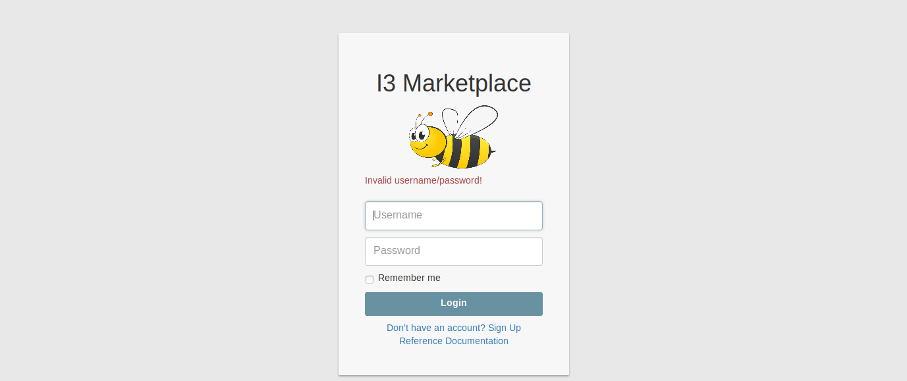

## Automating testing web input forms

**Learn how to automate opening a webpage, entering data into an input form, and clicking a button.**  This simple script automates testing that an error message appears when a user enters the wrong password

### Pre-requisites

In order to run this script, install [Selenium](https://selenium-python.readthedocs.io/installation.html) and [Python](https://www.python.org/downloads/).  Use a [Firefox browser](https://www.mozilla.org/en-US/firefox/)

### How it works

Import the Selenium libraries and import the time library 
```
from selenium import webdriver
from selenium.webdriver.common.by import By
from selenium.webdriver.common.keys import Keys
from selenium.webdriver.support.ui import WebDriverWait
from selenium.webdriver.support import expected_conditions as EC
import time
```
Use the Firefox web driver to run the tests
```
driver = webdriver.Firefox()
```
Set up the test by adding a link to the login webpage.  In this example, we are testing the I3 marketplace login page.  Print the name of the test.  Add a good username and a bad password.
```
driver.get("http://3.17.183.219:8000")
print("TEST 1 - user enters the wrong password")

usr = "Testuser"
pwd = "invalid"
```
Automate typing the username and the password
```
username = driver.find_element_by_id('inputEmail')
username.send_keys(usr)
password = driver.find_element_by_id('inputPassword')
password.send_keys(pwd)
```
Automate clicking the Login button
```
driver.find_element_by_xpath('//button[@type="submit"]').click()
```
Take a screen capture
```
driver.save_screenshot('Test1.png')
```


Wait 2 seconds to see what happens
```
time.sleep(2)
```
In this example, the expected result is

```
<p class="text-danger">Invalid username/password!</p>
```
Get the text from the result and compare it to the expected result.  If they match, then print a message saying the test passed.  If they do not match, then print the test results

```
res = driver.find_element_by_tag_name('p')
if res.text == 'Invalid username/password!':
	print("Test Passed with expected output: ", res.text)
else:
    print(res.text)
```
Shut down Firefox
```
driver.quit()
```

Congratulations!  You learned the basics for automating testing web input forms.

### Test drive the script

Here's the entire script:

[testLogin.py](code/testLogin.py)

### Resources

[Selenium-Python Read the Docs](https://selenium-python.readthedocs.io/navigating.html)
